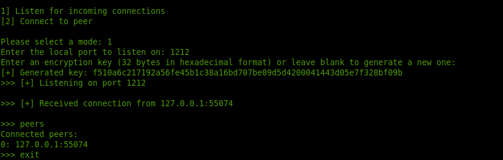
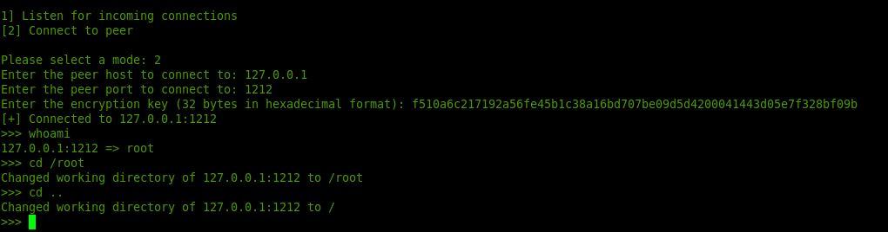

<h1 align="center">Clover P2P Reverse Shell</h1>

    

Clover P2P Reverse Shell allows you to establish a peer-to-peer (P2P) connection between two computers and execute shell commands on the remote computer.

 

## Requirements

To use Clover P2P Reverse Shell, you must have Python 3 installed on both computers.
 

## Installation
 
Clone or download the repository to your local machine.
Install the required packages by running pip install -r requirements.txt in your terminal or command prompt.
 

## Usage

 
Start the script on both computers by running python clover.py in your terminal or command prompt.
Choose the mode you want to use: either listen for incoming connections or connect to a peer.
Follow the on-screen instructions to enter the necessary information, such as the local port to listen on, the peer host to connect to, and the encryption key.
Once connected, you can execute shell commands on the remote computer by entering them in the command prompt.

## Example

 

## Disclaimer:

This project is intended for educational purposes only. The goal of this project is to learn how to establish a peer-to-peer (P2P) connection between two computers and execute shell commands on the remote computer. The project is not intended to be used for malicious purposes or to cause harm to any individual or organization. The authors of this project do not condone any illegal or unethical use of this software.
